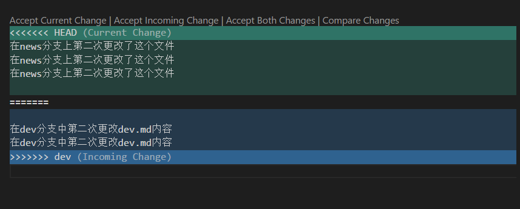

# Git

git是一个版本管理工具

官方文档 [https://git-scm.com/book/en/v2](https://git-scm.com/book/en/v2)

## 安装

windows下安装cmder时, 会同时安装好git-for-windows

mac下安装

- CLI: command line interface 命令行接口
- GUI: graphical user interface 图形化接口(图形化界面)

让git status显示中文文件名
执行下面这个命令
git config --global core.quotepath false

在vscode安装 Git History Diff 插件可以用来查看一些版本的差异

## 基础命令

查看当前仓库的状态
git status

把一个路径或者文件添加到暂存区
git add <path>

如 git add .  可以把当前的文件夹内的改变添加到暂存区

把改动提交到本地仓库
git commit -am <message>

把本地仓库的commit历史提交到远程仓库
git push origin master

### 分支操作

建立一个新的分支
git branch -b <分支名>
如: git branch -b liaoliao

切换到一个已经存在的分支
git checkout liaoliao

列出当前所有的分支
git branch -l

列出所有分支, 包括远程仓库的分支
git branch -la

### 远程仓库

给当前的本地仓库添加一个远程仓库

 git remote add github-liaoliao git@github.com:therewillbecold/whatever.git

列出远程仓库
~]$ git remote -v
输出:
 github-liaoliao git@github.com:therewillbecold/whatever.git (fetch)
github-liaoliao git@github.com:therewillbecold/whatever.git (push)
origin  git@github.com:therewillbecold/notes.git (fetch)
origin  git@github.com:therewillbecold/notes.git (push)

推送到远程仓库
git push origin master

从远程仓库拉取一个分支的代码, 会与当前所在的本地分支的代码进行合并
git pull orgin master


### 命令行创建一个仓库
命令行建立文件夹
mkdir git-practice
查看所有子文件
ls -a 
切换到所建文件夹
cd git-practice/
创建仓库
git init
查看是否创建成功
git status
移除此仓库
rm -rf git-practice/

## 版本合并

有几种情况

- 不同分支合并: git merge dev
- 不同的版本记录的合并
- 和远程分支的合并, 如 git pull origin master

如果两个不同的版本都更改了同一个地方, 则会产生冲突, 冲突的内容会如下标示出来



这里面的<<<<  到 ==== 的部分表示当前的分支, ==== 到 >>>> 的部分表示merge过来的分支,
如 当前在master 分支, 执行git merge dev 则会把dev分支合并到master分支

可以在全局搜索 ===== 或者 <<<< 搜索到冲突的位置, 手动解决冲突

## stash

git stash 可以把当前的更改存暂时保存起来, 此时仓库会回退到修改前的版本, 此时可以切到其他分支做一些操作. 完成之后可以切回到当前分支, 把原来编辑的内容取出来

git stash

查看stash中保存的内容
git stash list 

取出stash中的内容
git stash pop

扔掉stash中的某个记录
git stash drop <stash序号> 

## gitignore

在git项目的根目录里, 可以添加一个 .gitignore 文件, 可以设置一些忽略的文件
如

```
**/node_modules/*
.vscode/*
```


