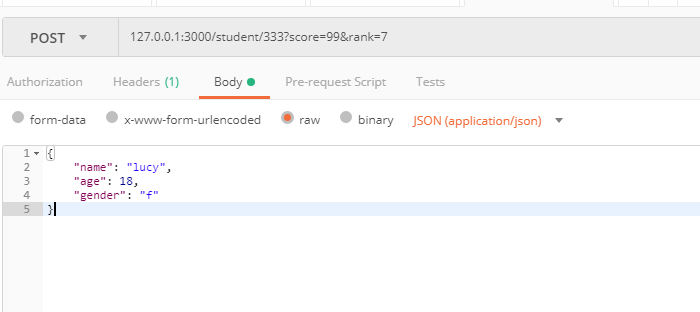

# node的基础知识

官方文档 https://nodejs.org/api/

## node 模块

CommonJS 是一种模块规范
node 采用的是commonJS 模块标准.

文档 https://nodejs.org/api/modules.html

require 可以引入一个模块
module.exports 可以导出一个模块中的变量, 一个模块只能有一个
exports 从模块中导出一个值, 一个模块可以有多个 exports

```
exports.Bfn = Bfn;
exports.name = 'bbbb'

// 等价于

module.exports = {
    Bfn: Bfn,
    name: 'bbb'
}

```

### 引用一个文件模块

require('./m')
require引用文件解析规则
1. 尝试去加载引用的文件m, 
2. 如果该文件不存在, 尝试加载 m.js
3. 如果没找到, 再依次尝试加载m.json, m.node

Without a leading '/', './', or '../' to indicate a file, the module must either be a core module or is loaded from a node_modules folder.

以 '/', './', '../' 开头的路径会作为一个文件进行加载. 否则的话会作为核心模块如 http, fs, URL, 或npm模块进行加载.

### 引用一个npm模块

解析规则

1. 找该模块的 package.json中的 main 字段, 该字段指定了入口文件
2. 如果没有main字段, 或者解析错误, 则报错 Error: Cannot find module 'some-library'
3. 如果没有package.json文件, 则会尝试加载 index.js

## NPM

官网 https://www.npmjs.com/

Node Packages Management: 是 node 的包管理器

初始化一个项目

```
> npm init
```
初始化之后, 会在项目下面生成一个 package.json文件, 和一个 node_modules文件夹

node_modules里面存放的是依赖的包

## node提供的一些变量

__dirname: 所执行的文件所在的绝对路径

## Express

express用来建立一个node服务的框架

安装express

```bash
npm install express --save
```
建立一个服务 server

```javascript
const express = require('express')
const app = express()
const port = 3000;

// 设置使用的模板引擎, 默认渲染 views 文件夹下的模板
app.set('view engine', 'ejs', {})

// app.use 使用一些中间件, middleware
// 建立一个静态资源服务
app.use(express.static('./static'))
app.use(function (req, res, next) {
    console.log('中间件1');
    next()
})

// 路由 Router

app.get('/', function (req, res) {
    // 使用模板引擎, 渲染 ./views/index.ejs 这个文件, 并返回给用户
    res.render('index', {username: '冰冰', messagenum: 56})
})

app.get('/games', function (req, res) {
    res.render('games', {username: '冰冰', messagenum: 56})
})


app.get('/news', function (req, res) {
    res.send('这是新闻')
})

app.post('/login', function (req,res) {
    res.send('登陆成功')
})

// 启动服务
app.listen(port, function (){
    console.log('服务已启动, 监听' +  port + '!')
})
```

### Express 的路由 Router

官方文档 http://expressjs.com/en/guide/routing.html


### Express 获取参数

https://blog.csdn.net/junshao90/article/details/8209166

```javascript

app.post('/student/:id', upload.array(), function (req, res) {
    console.log('params:', req.params);
    console.log('query:', req.query);
    console.log('body:', req.body);
    res.send('ok')
})

```

- req.params: 获取到 /students/:id/:score
- req.query: 获取参数 /students?id=3&name=lucy&hometown=shenzhen
- req.body: 获取http, body中带的参数

如下的post请求, 



则获取到的参数分别为

- req.params: { id: '333' }
- req.query: { score: '99', rank: '7' }
- req.body: { name: 'lucy', age: 18, gender: 'f' }


