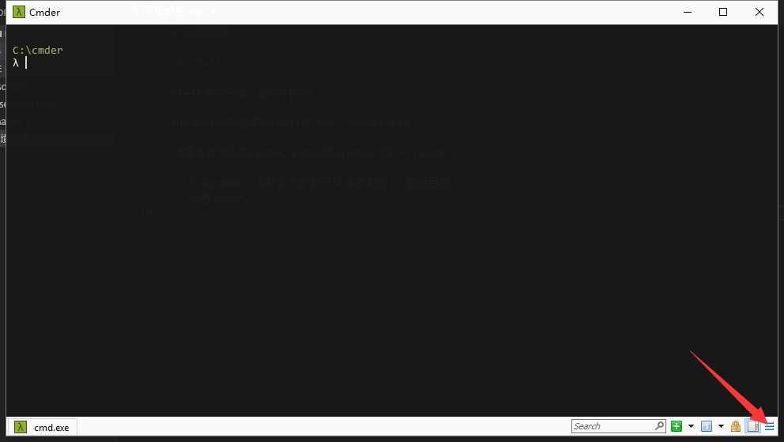
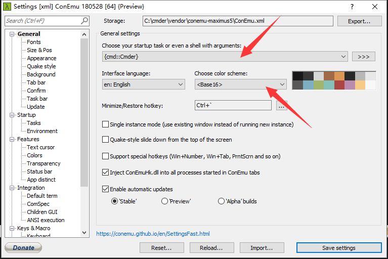
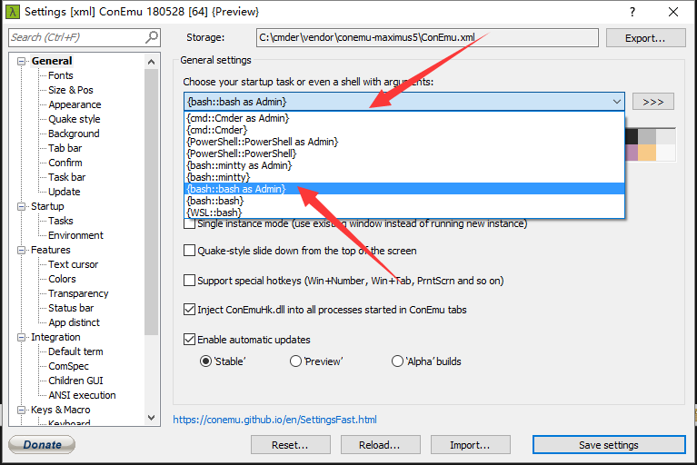
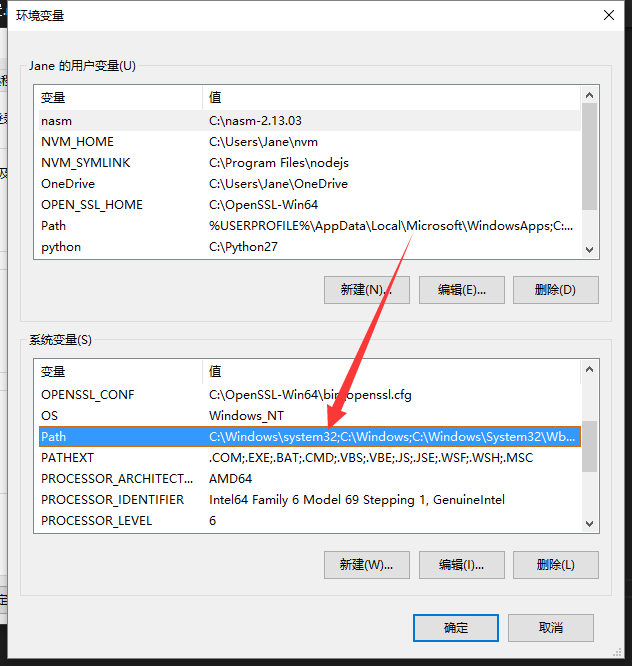

# 环境配置

## 配置shell

shell是用来输入命令的地方

windows系统自带的shell有 cmd, powershell

师尊喜欢用的是cmder, cmder是windows下的一个bash

1. 下载cmder, 把解压之后的文件夹复制到 C 盘根目录
2. 设置cmder, 



3. 改变颜色



4. 改变cmder启动时的默认shell, 我们选择bash as admin




## 安装nvm

nvm 是 node版本管理工具, node version management

对于windows系统安装nvm for windows, mac系统安装mac版的

windows版下载路径 [https://github.com/coreybutler/nvm-windows/releases](https://github.com/coreybutler/nvm-windows/releases)

mac下的nvm参考 [https://github.com/creationix/nvm#install-script](https://github.com/creationix/nvm#install-script)

下载好之后安装nvm软件

安装完成后在cmder里面输入 nvm -h 查看是否安装成功

```
# 输出nvm的帮助文件
nvm -h 
# 列出可用的node版本
nvm list avaiable
# 安装node, 8.11.3 (可替换)
nvm install 8.11.3 
# 查看node是否安装成功, 输出node的版本号
node -v
# 查看当前已安装的node版本
nvm list

```

## 安装node

安装nvm之后, nvm install 版本号  可以安装node, 如

```
nvm install 8.11.3 
```

## 设置系统环境变量

[系统环境变量位置](https://jingyan.baidu.com/article/b24f6c82cba6dc86bfe5da9f.html)

在系统的环境变量的PATH里面可用添加路径, 这些路径下的可执行文件可以直接在全局使用




## VS Code 安装配置

[https://code.visualstudio.com/](https://code.visualstudio.com/)

### 修改 vscode terminal(终端)

在 user setting中增加下面的配置, value是bash的路径

 "terminal.integrated.shell.windows": "C:/cmder/vendor/git-for-windows/bin/bash.exe",


### VsCode 装的插件

#### Paste Image

markdown 插入图片

配置图片默认保存路径
在 vscode 的 workspace settings 配置中增加下面配置项
 "pasteImage.path": "${projectRoot}/images" 

 ## 安装postman

 用来发送HTTP请求, 测试接口

 下载地址, https://www.getpostman.com/apps
 
 登陆Chrome之后, 应该会自动安装这个postman插件


